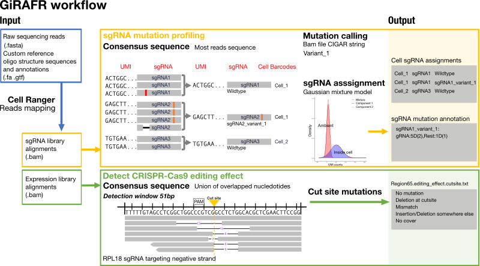

Introduction
============

GiRAFR is a python package developed to perform quality control of single cell CRISPR screens, and to assign gRNAs to cells in a sensitive, mutation-aware manner.

Citation
--------

**Abstract**
Novel single cell RNA-seq analysis combined with CRISPR screens enables the high- throughput characterization of transcriptional changes caused by genetic perturbations. Dedicated software to annotate CRISPR guide RNA (gRNA) libraries and associate them with single cell transcriptomes are however lacking. Here, we generated a CRISPR droplet sequencing dataset. We demonstrate that the current default tool fails to detect mutant gRNAs. We therefore developed GiRAFR, a pysam-based software tool to characterize intact and mutant gRNAs. We show that mutant gRNAs are dysfunctional, and failure to detect and annotate them leads to an inflated estimate of the number of untransformed cells as well as an underestimated multiplet frequency. These findings are mirrored in publicly available datasets, where we find that up to 34 % of cells are transduced with a mutant gRNA. Applying GiRAFR hence stands to improve the annotation and quality of single cell CRISPR screens.

Package workflow
----------------

Quickstart
----------

GiRAFR has two subcommands: ``gRNA_mutation`` and ``editing_effect``. Input file: ``ConfigFile`` is required for both subcommands. 

To create configuration file ``ConfigFile``, see :ref:`create configuration file to detect gRNA mutation <configuration_gRNA>` and :ref:`create configuration file to detect editing effect <configuration_editing>`

* Profile gRNA mutation in Single cell CRIPSR screen
        
.. code-block:: bash

        girafr gRNA_mutation -c abosolute_path/ConfigFile 

* Detect CRISPR-Cas9 editting effect in single cell RNA-seq:

.. code-block:: bash
        
        girafr editing_effect -c absolute_path/ConfigFile

If no -c/--config is used, girafr will try ``ConfigFile`` in the current path.

